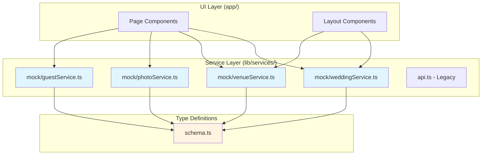
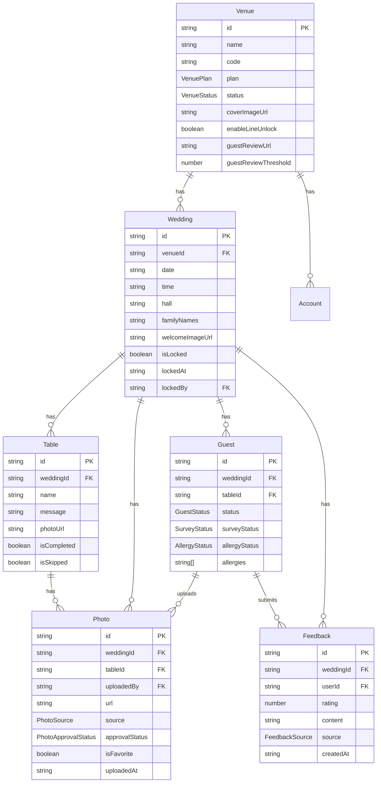
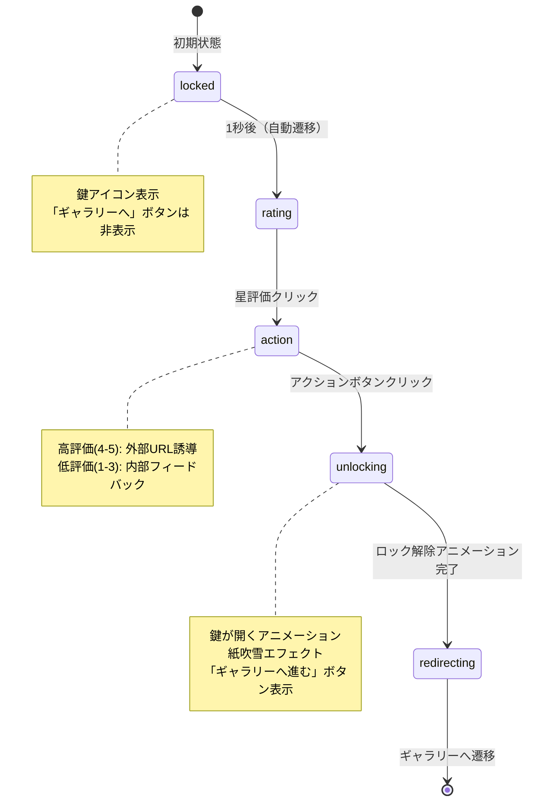
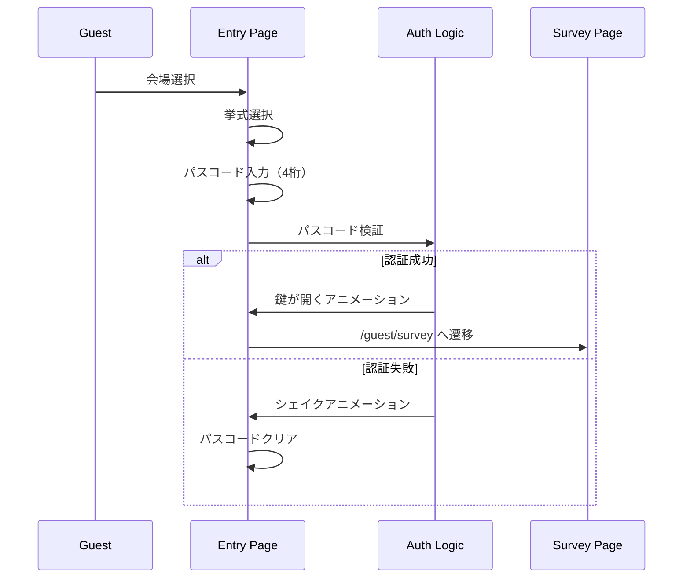

# Wedding Photo Sharing App - Handover Document

> **最終更新日**: 2024年12月  
> **対象読者**: バックエンドエンジニア、新規開発者  
> **重要**: このドキュメントは**実際に存在するコード**のみを正解として記述しています。実装されていない機能は「未実装」と明記しています。

---

## 📋 目次

1. [プロジェクト概要](#1-プロジェクト概要)
2. [アーキテクチャ & ディレクトリ構造](#2-アーキテクチャ--ディレクトリ構造)
3. [データモデル & スキーマ](#3-データモデル--スキーマ)
4. [主要機能のロジック解説](#4-主要機能のロジック解説)
5. [バックエンド開発者への実装ガイド](#5-バックエンド開発者への実装ガイド)
6. [環境変数 & 設定](#6-環境変数--設定)
7. [開発環境セットアップ](#7-開発環境セットアップ)

---

## 1. プロジェクト概要

### 1.1 アプリケーションの目的

結婚式の写真共有プラットフォーム。ゲストが写真をアップロードし、新郎新婦が管理・閲覧できるシステムです。

**主要な価値提案:**
- **ゲスト参加型演出**: ゲストが写真をアップロードして、リアルタイムで思い出を共有
- **卓ごとのアルバム**: 新郎新婦が各卓にメッセージと写真を設定し、ゲストがその卓のアルバムを閲覧
- **レビューゲート機能**: ゲストがレビューを完了することでギャラリーへのアクセスが解除される仕組み

### 1.2 ユーザーロール

`lib/types/schema.ts` で定義されているユーザーロール:

```typescript
type UserRole = 
  | 'SUPER_ADMIN'      // スーパーアドミン（システム全体の管理）
  | 'VENUE_ADMIN'      // 会場管理者（会場ごとの管理）
  | 'PLANNER'          // プランナー（挙式の管理）
  | 'COUPLE'           // 新郎新婦（自分の挙式の管理）
  | 'GUEST';           // ゲスト（写真のアップロード・閲覧）
```

**各ロールのアクセス範囲:**

| ロール | アクセス可能なルート | 主な機能 |
|--------|---------------------|----------|
| `GUEST` | `/guest/*` | 写真アップロード、ギャラリー閲覧、レビュー送信 |
| `COUPLE` | `/couple/*` | 卓設定、写真管理、ギャラリー閲覧 |
| `PLANNER` | `/dashboard/*` | 挙式管理、ゲスト管理、フィードバック確認 |
| `VENUE_ADMIN` | `/dashboard/[venueId]/*` | 会場設定、アカウント管理 |
| `SUPER_ADMIN` | `/admin/*` | システム全体の管理、会場管理 |

### 1.3 技術スタック

**フロントエンド:**
- **Next.js 15.1.0** (App Router)
- **React 18.3.1**
- **TypeScript 5.5.0** (strict mode)
- **Tailwind CSS 3.4.4** (ユーティリティファースト)
- **Shadcn/ui** (Radix UIベースのコンポーネントライブラリ)
- **Framer Motion 12.25.0** (アニメーション)
- **Sonner 2.0.7** (Toast通知)
- **Canvas Confetti 1.9.4** (パーティクルエフェクト)
- **JSZip 3.10.1** & **file-saver 2.0.5** (ZIPダウンロード)
- **React Responsive Masonry 2.1.0** (Masonryレイアウト)
- **Zod 4.3.5** (バリデーション)
- **SWR 2.3.8** (データフェッチング、一部で使用)
- **Zustand 5.0.9** (状態管理、一部で使用)

**開発ツール:**
- **ESLint** (Next.js標準設定)
- **PostCSS** & **Autoprefixer**
- **TypeScript** (strict mode)

---

## 2. アーキテクチャ & ディレクトリ構造

### 2.1 Service Repositoryパターンの採用

このプロジェクトは**Service Repositoryパターン**を採用しており、UIコンポーネントとデータ取得ロジックを完全に分離しています。

#### 2.1.1 アーキテクチャ図



#### 2.1.2 疎結合の実現方法

**UIコンポーネントは「データの取得方法」を知りません:**

```typescript
// ❌ 悪い例（直接MOCKデータを参照）
const MOCK_WEDDING = { weddingDate: new Date(), ... };
const daysUntil = calculateDaysUntil(MOCK_WEDDING.weddingDate);

// ✅ 良い例（Service層経由）
import { getWeddingDate } from '@/lib/services/mock/weddingService';

const [weddingDate, setWeddingDate] = useState<Date | null>(null);
useEffect(() => {
  const loadData = async () => {
    const date = await getWeddingDate(MOCK_WEDDING_ID);
    setWeddingDate(date);
  };
  loadData();
}, []);
```

**メリット:**
1. **バックエンド実装の変更がUIに影響しない**: Service関数の内部実装を変更するだけで、UIコンポーネントは変更不要
2. **テストが容易**: Service層をモック化して、UIの動作をテストできる
3. **型安全性**: `schema.ts` で定義された型が強制されるため、型エラーを早期発見できる

### 2.2 ディレクトリ構造

```
guest-link/
├── app/                          # Next.js App Router
│   ├── (auth)/                   # 認証関連（ルートグループ）
│   │   └── login/
│   ├── (dashboard)/              # プランナー・会場管理者用（ルートグループ）
│   │   └── dashboard/
│   │       ├── (auth)/           # 認証が必要なページ
│   │       └── (main)/           # 認証後のメインページ
│   │           └── [venueId]/   # 会場ID動的ルート
│   ├── (guest)/                  # ゲスト用（ルートグループ）
│   │   └── guest/
│   │       ├── (entry)/          # 入口画面（パスコード認証）
│   │       ├── (onboarding)/     # オンボーディング（レビュー）
│   │       └── (main)/           # メイン機能（ギャラリー）
│   ├── admin/                    # スーパーアドミン用
│   ├── couple/                   # 新郎新婦用
│   │   ├── page.tsx              # ホーム画面
│   │   ├── tables/               # 卓設定
│   │   ├── gallery/              # 写真ギャラリー
│   │   └── login/                # ログイン
│   └── layout.tsx                # ルートレイアウト
│
├── components/                   # 再利用可能なUIコンポーネント
│   ├── ui/                       # Shadcn/uiコンポーネント
│   ├── admin/                    # 管理画面用コンポーネント
│   ├── guest/                    # ゲスト用コンポーネント
│   └── ...
│
├── lib/
│   ├── types/
│   │   └── schema.ts            # 共通型定義（最重要）
│   ├── services/
│   │   ├── mock/                 # Mock Service層（バックエンド実装待ち）
│   │   │   ├── weddingService.ts
│   │   │   ├── venueService.ts
│   │   │   ├── photoService.ts
│   │   │   ├── guestService.ts
│   │   │   └── index.ts
│   │   ├── api.ts                # Legacy API層（一部で使用）
│   │   └── notificationService.ts
│   ├── constants/                # 定数定義
│   │   ├── venues.ts
│   │   └── external.ts
│   └── utils/                    # ユーティリティ関数
│
└── public/                       # 静的ファイル
```

### 2.3 ルートグループの意図

Next.jsの**Route Groups** `(name)` を使用して、レイアウトと認証境界を分離しています。

| ルートグループ | 目的 | レイアウト |
|--------------|------|-----------|
| `(auth)` | 認証が必要なページ | 認証レイアウト |
| `(dashboard)` | プランナー・会場管理者用 | ダッシュボードレイアウト |
| `(guest)` | ゲスト用 | ゲストレイアウト |
| `(entry)` | ゲスト入口（パスコード認証前） | エントリーレイアウト |
| `(onboarding)` | ゲストオンボーディング（レビュー） | オンボーディングレイアウト |
| `(main)` | ゲストメイン機能（ギャラリー） | メインレイアウト |

**例: ゲストのフロー**

```
/guest/(entry)/page.tsx          # パスコード入力
    ↓ (認証成功)
/guest/(onboarding)/survey/page.tsx  # レビュー回答
    ↓ (レビュー完了)
/guest/(main)/gallery/page.tsx   # ギャラリー閲覧
```

---

## 3. データモデル & スキーマ

### 3.1 ER図



### 3.2 主要エンティティの詳細

#### 3.2.1 Venue (会場)

**ファイル**: `lib/types/schema.ts` (159-212行目)

**重要なフィールド:**

```typescript
interface Venue {
  id: string;
  name: string;
  code: string;                    // URLに使用される識別子
  plan: VenuePlan;                 // 'LIGHT' | 'STANDARD' | 'PREMIUM'
  status: VenueStatus;            // 'ACTIVE' | 'SUSPENDED' | 'ONBOARDING'
  
  // 動的設定項目（新規追加）
  coverImageUrl?: string;          // ゲスト入口画面の背景画像
  enableLineUnlock?: boolean;      // LINE連携による投稿制限解除機能の有効/無効
  
  // レビュー設定
  guestReviewUrl?: string;         // ゲスト向けレビュー投稿URL
  guestReviewThreshold?: number;    // 外部誘導する最低星数
  coupleReviewUrl?: string;         // 新郎新婦向けレビュー投稿URL
  coupleReviewThreshold?: number;   // 新郎新婦向け外部誘導の最低星数
}
```

**使用箇所:**
- `app/(guest)/guest/(main)/gallery/page.tsx`: `coverImageUrl` を背景画像として使用
- `app/(guest)/guest/(main)/gallery/page.tsx`: `enableLineUnlock` でアップロード制限ロジックを分岐

#### 3.2.2 Wedding (挙式)

**ファイル**: `lib/types/schema.ts` (232-289行目)

**重要なフィールド:**

```typescript
interface Wedding {
  id: string;
  date: string;                    // ISO 8601形式の日付
  time: string;                    // HH:mm形式
  hall: string;                    // 会場名（ホール名）
  familyNames: string;             // 新郎新婦の家族名（表示用）
  
  // 動的設定項目（新規追加）
  welcomeImageUrl?: string;        // ギャラリー画面の背景画像
  
  // ロック機能
  isLocked: boolean;               // データ確定（ロック）されているか
  lockedAt: string | null;         // ロック日時
  lockedBy: string | null;         // ロックしたユーザーID
  
  venueId?: string;                // 会場ID（将来的に追加予定）
}
```

**使用箇所:**
- `app/couple/layout.tsx`: `welcomeImageUrl` をヒーローセクションの背景として使用
- `app/couple/page.tsx`: 挙式日をカウントダウン表示

#### 3.2.3 Table (卓)

**ファイル**: `lib/types/schema.ts` (303-333行目)

**重要なフィールド:**

```typescript
interface Table {
  id: string;
  name: string;                    // 卓名（例: "A", "B", "1", "2"）
  message: string;                  // 新郎新婦からのメッセージ
  photoUrl: string | null;         // 卓用の写真URL
  isCompleted: boolean;            // 完了状態（写真・メッセージが設定済みか）
  isSkipped: boolean;              // スキップ済みか（共通写真を使用する場合）
  weddingId: string;              // 挙式ID（外部キー）
}
```

**使用箇所:**
- `app/couple/tables/page.tsx`: 卓設定画面で編集
- `app/(guest)/guest/(main)/gallery/page.tsx`: 卓ごとのアルバムタブで表示

#### 3.2.4 Photo (写真)

**ファイル**: `lib/types/schema.ts` (382-421行目)

**重要なフィールド:**

```typescript
interface Photo {
  id: string;
  url: string;                     // ストレージ上のパスまたはURL
  alt?: string;                    // 写真の説明・キャプション
  source: PhotoSource;             // 'couple' | 'guest' | 'table'
  weddingId: string;              // 挙式ID（外部キー）
  tableId: string | null;          // 卓ID（卓ごとの写真の場合、全員向けの場合は null）
  uploadedBy: string;             // アップロードしたユーザーID（外部キー）
  approvalStatus?: PhotoApprovalStatus;  // 'pending' | 'approved' | 'rejected'
  isFavorite?: boolean;            // お気に入りフラグ（新郎新婦がお気に入りにしたか）
  isMyPhoto?: boolean;            // 自分の写真か（ゲスト側のUI用フラグ）
  uploadedAt: string;             // アップロード日時（ISO 8601形式）
}
```

**使用箇所:**
- `app/(guest)/guest/(main)/gallery/page.tsx`: ゲストがアップロード・閲覧
- `app/couple/gallery/page.tsx`: 新郎新婦が閲覧・お気に入り登録

#### 3.2.5 Guest (ゲスト)

**ファイル**: `lib/types/schema.ts` (68-94行目)

**重要なフィールド:**

```typescript
interface Guest extends User {
  role: 'GUEST';
  weddingId: string;              // 挙式ID（外部キー）
  tableId: string | null;         // 卓ID（配席確定前は null）
  status: GuestStatus;            // 'pending' | 'confirmed' | 'locked'
  surveyStatus: SurveyStatus;    // 'not_answered' | 'answered' | 'approved'
  allergyStatus: AllergyStatus;  // 'none' | 'reported' | 'confirmed'
  allergies: string[];           // アレルギー情報（文字列配列）
}
```

**使用箇所:**
- `app/(guest)/guest/(onboarding)/survey/page.tsx`: レビュー完了後に `surveyStatus` を更新

---

## 4. 主要機能のロジック解説

### 4.1 厳格なレビューゲート機能

**ファイル**: `app/(guest)/guest/(onboarding)/survey/page.tsx`

#### 4.1.1 フロー図



#### 4.1.2 実装の詳細

**ステップ定義:**

```typescript
type Step = 'locked' | 'rating' | 'action' | 'unlocking' | 'redirecting';
```

**設定値（会場ごとに変更可能）:**

```typescript
const REVIEW_CONFIG = {
  url: 'https://maps.google.com/?q=表参道テラス',  // レビュー投稿先URL
  minRatingForExternal: 4,  // 外部誘導する最低星数（4以上なら外部、3以下なら内部）
} as const;
```

**分岐ロジック:**

```typescript
// 評価が高い場合（設定値以上）は外部誘導あり、低い場合（設定値未満）は内部フィードバックのみ
const isHighRating = rating >= REVIEW_CONFIG.minRatingForExternal;

// 高評価の場合: 外部レビューサイトへ誘導
if (isHighRating) {
  window.open(REVIEW_CONFIG.url, '_blank');
  showUnlockAnimation();  // ロック解除アニメーション
} else {
  // 低評価の場合: 内部フィードバックを送信
  await submitReview(weddingId, userId, rating, feedbackText);
  showUnlockAnimation();
}
```

**重要なポイント:**

1. **「ギャラリーへ進む」ボタンは `unlocking` ステップで初めて表示される**
   - `locked`, `rating`, `action` ステップでは非表示
   - レビューアクション（外部URL開く or フィードバック送信）を実行した後にのみ表示

2. **LocalStorageによる状態管理:**
   ```typescript
   const getReviewStorageKey = (guestId?: string) => {
     return `wedding_app_review_completed_${guestId || 'default'}`;
   };
   ```
   - レビュー完了状態をLocalStorageに保存
   - 次回アクセス時にスキップ可能（実装予定）

3. **紙吹雪エフェクト:**
   - `canvas-confetti` を使用してロック解除時に視覚的なフィードバックを提供

### 4.2 写真アップロード & LINE連携制限

**ファイル**: `app/(guest)/guest/(main)/gallery/page.tsx`

#### 4.2.1 アップロード枚数制限ロジック

**制限ルール:**
- デフォルト: **5枚まで**アップロード可能
- `enableLineUnlock === true` の場合: LINE連携で制限解除可能
- `enableLineUnlock === false` の場合: 5枚でハードリミット

**実装:**

```typescript
// 会場設定の読み込み
const [venueInfo, setVenueInfo] = useState<{
  name: string;
  coverImage: string;
  enableLineUnlock: boolean;
} | null>(null);

useEffect(() => {
  const loadData = async () => {
    const venue = await getVenueInfo(MOCK_VENUE_ID);
    setVenueInfo({
      name: venue.name,
      coverImage: venue.coverImageUrl || '...',
      enableLineUnlock: venue.enableLineUnlock || false,
    });
  };
  loadData();
}, []);

// ファイル選択時の制限チェック
const handleFileSelect = (e: React.ChangeEvent<HTMLInputElement>) => {
  const files = Array.from(e.target.files || []);
  
  // 枚数制限チェック
  if (uploadedCount + files.length > 5) {
    if (venueInfo?.enableLineUnlock) {
      // LINE連携モーダルを表示
      setShowLimitModal(true);
    } else {
      // エラートーストを表示（ハードリミット）
      toast.error('申し訳ありません。投稿枚数の上限（5枚）に達しました。');
    }
    return;
  }
  
  // コンプライアンスチェックモーダルを表示
  setShowComplianceModal(true);
  setSelectedFiles(files);
};
```

**UIの条件分岐:**

```typescript
{/* LINE連携ボタン（enableLineUnlockがtrueの場合のみ表示） */}
{venueInfo?.enableLineUnlock && (
  <button onClick={handleLineConnect}>
    LINE連携で無制限にする
  </button>
)}

{/* 上限到達時のメッセージ */}
{uploadedCount >= 5 && !venueInfo?.enableLineUnlock && (
  <p>投稿枚数の上限に達しました</p>
)}
```

### 4.3 ダウンロード機能

**ファイル**: `app/couple/gallery/page.tsx`

#### 4.3.1 単一ダウンロード（スマホ対応）

**優先順位:**
1. **Web Share API** (モバイル端末)
2. **Blob形式での強制ダウンロード** (PC/非対応ブラウザ)

**実装:**

```typescript
const executeDownload = async (photoUrl: string, photoId: string) => {
  try {
    // 1. Web Share APIを試行（モバイル端末）
    if (navigator.share) {
      const response = await fetch(photoUrl);
      const blob = await response.blob();
      const file = new File([blob], `photo-${photoId}.jpg`, { type: blob.type });
      
      await navigator.share({
        files: [file],
        title: '写真を共有',
      });
      return;
    }
    
    // 2. Blob形式での強制ダウンロード（PC/非対応ブラウザ）
    const response = await fetch(photoUrl);
    const blob = await response.blob();
    const url = window.URL.createObjectURL(blob);
    const a = document.createElement('a');
    a.href = url;
    a.download = `photo-${photoId}.jpg`;
    document.body.appendChild(a);
    a.click();
    document.body.removeChild(a);
    window.URL.revokeObjectURL(url);
  } catch (error: unknown) {
    if (error instanceof Error && error.name !== 'AbortError') {
      console.warn('Web Share API failed, falling back to blob download:', error);
      // フォールバック処理
    }
  }
};
```

#### 4.3.2 一括ダウンロード（ZIP圧縮）

**実装:**

```typescript
const executeBulkDownload = async () => {
  const loadingToastId = toast.loading('ZIPファイルを作成中...');
  
  try {
    const zip = new JSZip();
    const photosToDownload = photos;  // 選択された写真または全ての写真
    
    // 全ての画像を並列で取得してZIPに追加
    const fetchPromises = photosToDownload.map(async (photo, index) => {
      try {
        const response = await fetch(photo.url);
        const blob = await response.blob();
        const filename = `photo-${photo.id || index + 1}.jpg`;
        zip.file(filename, blob);
      } catch (error) {
        console.warn(`Failed to fetch photo ${photo.id}:`, error);
      }
    });
    
    await Promise.allSettled(fetchPromises);
    
    // ZIPファイルを生成
    const zipBlob = await zip.generateAsync({ 
      type: 'blob',
      compression: 'DEFLATE',
      compressionOptions: { level: 6 },
    });
    
    // file-saverでダウンロード
    const filename = `wedding-photos-${new Date().toISOString().split('T')[0]}.zip`;
    saveAs(zipBlob, filename);
    
    toast.success('ZIPファイルのダウンロードを開始しました', {
      id: loadingToastId,
      description: `${photosToDownload.length}枚の写真が含まれています`,
    });
  } catch (error) {
    toast.error('ダウンロードに失敗しました', { id: loadingToastId });
  }
};
```

### 4.4 入室フロー（パスコード認証）

**ファイル**: `app/(guest)/guest/(entry)/page.tsx`

#### 4.4.1 フロー



#### 4.4.2 実装の詳細

**パスコード検証:**

```typescript
useEffect(() => {
  if (passcode.length === 4 && selectedWedding && !isUnlocking && !isUnlocked) {
    setIsUnlocking(true);
    
    // 認証処理のシミュレーション（実際はAPI呼び出し）
    setTimeout(() => {
      if (passcode === selectedWedding.passcode) {
        setIsUnlocked(true);
        setTimeout(() => {
          router.push('/guest/survey');
        }, 1500);
      } else {
        setIsUnlocking(false);
        setShake(true);
        setTimeout(() => {
          setShake(false);
          setPasscode('');
        }, 600);
      }
    }, 500);
  }
}, [passcode, selectedWedding, isUnlocking, isUnlocked]);
```

**注意**: 現在はモックデータで動作しています。実際の実装では、バックエンドAPIでパスコードを検証する必要があります。

---

## 5. バックエンド開発者への実装ガイド

### 5.1 Service層の実装方針

**現在の状態:**
- `lib/services/mock/` ディレクトリ内のすべての関数がモック実装
- 各関数に `BACKEND_TODO` コメントが記載されている
- UIコンポーネントは既にService層を使用しているため、**Service層の実装のみでバックエンド連携が完了**

### 5.2 実装が必要なService関数一覧

#### 5.2.1 Wedding Service (`lib/services/mock/weddingService.ts`)

| 関数名 | 引数 | 戻り値 | APIエンドポイント | DBテーブル |
|--------|------|--------|------------------|-----------|
| `getWeddingInfo` | `weddingId: string` | `Promise<Wedding>` | `GET /api/weddings/:weddingId` | `weddings` |
| `updateWelcomeMessage` | `weddingId: string, welcomeImageUrl: string` | `Promise<Wedding>` | `PATCH /api/weddings/:weddingId` | `weddings` + Storage |
| `getWeddingTables` | `weddingId: string` | `Promise<Table[]>` | `GET /api/weddings/:weddingId/tables` | `tables` |
| `getWeddingDate` | `weddingId: string` | `Promise<Date>` | `GET /api/weddings/:weddingId` | `weddings` |

**実装例:**

```typescript
// lib/services/mock/weddingService.ts を lib/services/weddingService.ts にリネーム後

export async function getWeddingInfo(weddingId: string): Promise<Wedding> {
  const response = await fetch(`/api/weddings/${weddingId}`, {
    headers: {
      'Authorization': `Bearer ${getAuthToken()}`,  // 認証トークン
    },
  });
  
  if (!response.ok) {
    throw new Error(`Failed to fetch wedding: ${response.statusText}`);
  }
  
  return response.json();
}
```

**Storage実装（`updateWelcomeMessage`）:**

```typescript
export async function updateWelcomeMessage(
  weddingId: string,
  welcomeImageUrl: string
): Promise<Wedding> {
  // 1. 画像をSupabase Storageにアップロード
  const file = await fetch(welcomeImageUrl).then(r => r.blob());
  const fileName = `wedding-${weddingId}-welcome-${Date.now()}.jpg`;
  const { data: uploadData, error: uploadError } = await supabase.storage
    .from('wedding-welcome-images')
    .upload(fileName, file);
  
  if (uploadError) throw uploadError;
  
  // 2. 公開URLを取得
  const { data: { publicUrl } } = supabase.storage
    .from('wedding-welcome-images')
    .getPublicUrl(fileName);
  
  // 3. データベースを更新
  const response = await fetch(`/api/weddings/${weddingId}`, {
    method: 'PATCH',
    headers: {
      'Content-Type': 'application/json',
      'Authorization': `Bearer ${getAuthToken()}`,
    },
    body: JSON.stringify({ welcomeImageUrl: publicUrl }),
  });
  
  if (!response.ok) {
    throw new Error(`Failed to update wedding: ${response.statusText}`);
  }
  
  return response.json();
}
```

#### 5.2.2 Venue Service (`lib/services/mock/venueService.ts`)

| 関数名 | 引数 | 戻り値 | APIエンドポイント | DBテーブル |
|--------|------|--------|------------------|-----------|
| `getVenueInfo` | `venueId: string` | `Promise<Venue>` | `GET /api/venues/:venueId` | `venues` |
| `updateVenueSettings` | `venueId: string, updates: Partial<Venue>` | `Promise<Venue>` | `PATCH /api/venues/:venueId` | `venues` |

**実装例:**

```typescript
export async function getVenueInfo(venueId: string): Promise<Venue> {
  const response = await fetch(`/api/venues/${venueId}`, {
    headers: {
      'Authorization': `Bearer ${getAuthToken()}`,
    },
  });
  
  if (!response.ok) {
    throw new Error(`Failed to fetch venue: ${response.statusText}`);
  }
  
  return response.json();
}
```

#### 5.2.3 Photo Service (`lib/services/mock/photoService.ts`)

| 関数名 | 引数 | 戻り値 | APIエンドポイント | Storage | DBテーブル |
|--------|------|--------|------------------|---------|-----------|
| `uploadPhoto` | `file: File, weddingId: string, tableId: string \| null, uploaderId: string` | `Promise<Photo>` | `POST /api/photos` | `wedding-photos/:weddingId/:tableId/` | `photos` |
| `uploadPhotos` | `files: File[], weddingId: string, tableId: string \| null, uploaderId: string` | `Promise<Photo[]>` | `POST /api/photos/batch` | 同上 | `photos` |
| `getPhotosByTable` | `tableId: string` | `Promise<Photo[]>` | `GET /api/tables/:tableId/photos` | - | `photos` |
| `getPhotosByWedding` | `weddingId: string` | `Promise<Photo[]>` | `GET /api/weddings/:weddingId/photos` | - | `photos` |
| `deletePhoto` | `photoId: string, userId: string` | `Promise<boolean>` | `DELETE /api/photos/:photoId` | Storage削除 | `photos` |
| `togglePhotoFavorite` | `photoId: string, isFavorite: boolean` | `Promise<Photo>` | `PATCH /api/photos/:photoId/favorite` | - | `photos` |

**実装例（`uploadPhoto`）:**

```typescript
export async function uploadPhoto(
  file: File,
  weddingId: string,
  tableId: string | null,
  uploaderId: string
): Promise<Photo> {
  // 1. Supabase Storageにアップロード
  const fileName = `${weddingId}/${tableId || 'all'}/${Date.now()}-${file.name}`;
  const { data: uploadData, error: uploadError } = await supabase.storage
    .from('wedding-photos')
    .upload(fileName, file);
  
  if (uploadError) throw uploadError;
  
  // 2. 公開URLを取得
  const { data: { publicUrl } } = supabase.storage
    .from('wedding-photos')
    .getPublicUrl(fileName);
  
  // 3. データベースにレコードを作成
  const response = await fetch('/api/photos', {
    method: 'POST',
    headers: {
      'Content-Type': 'application/json',
      'Authorization': `Bearer ${getAuthToken()}`,
    },
    body: JSON.stringify({
      url: publicUrl,
      weddingId,
      tableId,
      uploadedBy: uploaderId,
      source: tableId ? 'table' : 'guest',
      approvalStatus: 'approved',  // または 'pending'（承認フローがある場合）
    }),
  });
  
  if (!response.ok) {
    throw new Error(`Failed to upload photo: ${response.statusText}`);
  }
  
  return response.json();
}
```

#### 5.2.4 Guest Service (`lib/services/mock/guestService.ts`)

| 関数名 | 引数 | 戻り値 | APIエンドポイント | DBテーブル |
|--------|------|--------|------------------|-----------|
| `submitReview` | `weddingId: string, userId: string, rating: number, content?: string` | `Promise<Feedback>` | `POST /api/feedbacks` | `feedbacks` |
| `unlockGallery` | `guestId: string` | `Promise<Guest>` | `POST /api/guests/:guestId/unlock-gallery` | `guests` |
| `getGuestInfo` | `guestId: string` | `Promise<Guest>` | `GET /api/guests/:guestId` | `guests` |

**実装例（`submitReview`）:**

```typescript
export async function submitReview(
  weddingId: string,
  userId: string,
  rating: number,
  content?: string
): Promise<Feedback> {
  const response = await fetch('/api/feedbacks', {
    method: 'POST',
    headers: {
      'Content-Type': 'application/json',
      'Authorization': `Bearer ${getAuthToken()}`,
    },
    body: JSON.stringify({
      weddingId,
      userId,
      rating,
      content: content || '',
      source: 'GUEST',
    }),
  });
  
  if (!response.ok) {
    throw new Error(`Failed to submit review: ${response.statusText}`);
  }
  
  return response.json();
}
```

### 5.3 データベーススキーマ推奨

**主要テーブル:**

```sql
-- 会場テーブル
CREATE TABLE venues (
  id VARCHAR(255) PRIMARY KEY,
  name VARCHAR(255) NOT NULL,
  code VARCHAR(255) UNIQUE NOT NULL,
  plan VARCHAR(50) NOT NULL,  -- 'LIGHT', 'STANDARD', 'PREMIUM'
  status VARCHAR(50) NOT NULL,  -- 'ACTIVE', 'SUSPENDED', 'ONBOARDING'
  cover_image_url TEXT,
  enable_line_unlock BOOLEAN DEFAULT false,
  guest_review_url TEXT,
  guest_review_threshold INTEGER DEFAULT 4,
  created_at TIMESTAMP DEFAULT CURRENT_TIMESTAMP,
  updated_at TIMESTAMP DEFAULT CURRENT_TIMESTAMP
);

-- 挙式テーブル
CREATE TABLE weddings (
  id VARCHAR(255) PRIMARY KEY,
  venue_id VARCHAR(255) REFERENCES venues(id),
  date DATE NOT NULL,
  time VARCHAR(10) NOT NULL,  -- HH:mm形式
  hall VARCHAR(255) NOT NULL,
  family_names VARCHAR(255) NOT NULL,
  welcome_image_url TEXT,
  is_locked BOOLEAN DEFAULT false,
  locked_at TIMESTAMP,
  locked_by VARCHAR(255),
  created_at TIMESTAMP DEFAULT CURRENT_TIMESTAMP,
  updated_at TIMESTAMP DEFAULT CURRENT_TIMESTAMP
);

-- 卓テーブル
CREATE TABLE tables (
  id VARCHAR(255) PRIMARY KEY,
  wedding_id VARCHAR(255) NOT NULL REFERENCES weddings(id),
  name VARCHAR(50) NOT NULL,
  message TEXT DEFAULT '',
  photo_url TEXT,
  is_completed BOOLEAN DEFAULT false,
  is_skipped BOOLEAN DEFAULT false,
  created_at TIMESTAMP DEFAULT CURRENT_TIMESTAMP,
  updated_at TIMESTAMP DEFAULT CURRENT_TIMESTAMP
);

-- 写真テーブル
CREATE TABLE photos (
  id VARCHAR(255) PRIMARY KEY,
  wedding_id VARCHAR(255) NOT NULL REFERENCES weddings(id),
  table_id VARCHAR(255) REFERENCES tables(id),
  uploaded_by VARCHAR(255) NOT NULL,  -- ユーザーID
  url TEXT NOT NULL,  -- Storage上のURL
  alt TEXT,
  source VARCHAR(50) NOT NULL,  -- 'couple', 'guest', 'table'
  approval_status VARCHAR(50) DEFAULT 'pending',  -- 'pending', 'approved', 'rejected'
  is_favorite BOOLEAN DEFAULT false,
  uploaded_at TIMESTAMP DEFAULT CURRENT_TIMESTAMP,
  created_at TIMESTAMP DEFAULT CURRENT_TIMESTAMP,
  updated_at TIMESTAMP DEFAULT CURRENT_TIMESTAMP
);

-- ゲストテーブル
CREATE TABLE guests (
  id VARCHAR(255) PRIMARY KEY,
  wedding_id VARCHAR(255) NOT NULL REFERENCES weddings(id),
  table_id VARCHAR(255) REFERENCES tables(id),
  name VARCHAR(255) NOT NULL,
  email VARCHAR(255) NOT NULL,
  status VARCHAR(50) DEFAULT 'pending',  -- 'pending', 'confirmed', 'locked'
  survey_status VARCHAR(50) DEFAULT 'not_answered',  -- 'not_answered', 'answered', 'approved'
  allergy_status VARCHAR(50) DEFAULT 'none',  -- 'none', 'reported', 'confirmed'
  allergies TEXT[],  -- PostgreSQL配列型
  created_at TIMESTAMP DEFAULT CURRENT_TIMESTAMP,
  updated_at TIMESTAMP DEFAULT CURRENT_TIMESTAMP
);

-- フィードバックテーブル
CREATE TABLE feedbacks (
  id VARCHAR(255) PRIMARY KEY,
  wedding_id VARCHAR(255) NOT NULL REFERENCES weddings(id),
  user_id VARCHAR(255) NOT NULL,
  rating INTEGER NOT NULL CHECK (rating >= 1 AND rating <= 5),
  content TEXT DEFAULT '',
  source VARCHAR(50) NOT NULL,  -- 'COUPLE', 'GUEST'
  created_at TIMESTAMP DEFAULT CURRENT_TIMESTAMP
);
```

**インデックス推奨:**

```sql
CREATE INDEX idx_photos_wedding_id ON photos(wedding_id);
CREATE INDEX idx_photos_table_id ON photos(table_id);
CREATE INDEX idx_photos_uploaded_by ON photos(uploaded_by);
CREATE INDEX idx_tables_wedding_id ON tables(wedding_id);
CREATE INDEX idx_guests_wedding_id ON guests(wedding_id);
CREATE INDEX idx_guests_table_id ON guests(table_id);
CREATE INDEX idx_feedbacks_wedding_id ON feedbacks(wedding_id);
```

### 5.4 実装手順

1. **`lib/services/mock/` を `lib/services/` にリネーム**
   ```bash
   mv lib/services/mock lib/services/real
   ```

2. **各Serviceファイルの `BACKEND_TODO` コメントを実装に置き換え**

3. **環境変数の設定**
   - APIベースURL
   - 認証トークンの取得方法
   - Storage設定（Supabase等）

4. **エラーハンドリングの追加**
   - ネットワークエラー
   - 認証エラー
   - バリデーションエラー

5. **型定義の確認**
   - `lib/types/schema.ts` の型定義とAPIレスポンスが一致しているか確認

---

## 6. 環境変数 & 設定

### 6.1 環境変数（`.env.local`）

**現在の実装状況**: 環境変数ファイルは存在しません（未実装）

**推奨される環境変数:**

```bash
# API設定
NEXT_PUBLIC_API_BASE_URL=http://localhost:3000/api
NEXT_PUBLIC_API_URL=https://api.example.com

# 認証設定
NEXT_PUBLIC_AUTH_DOMAIN=auth.example.com

# 外部サービス
NEXT_PUBLIC_GOOGLE_MAPS_URL=https://www.google.com/maps
NEXT_PUBLIC_LINE_ID=@your_line_id

# Storage設定（Supabase等）
NEXT_PUBLIC_SUPABASE_URL=https://xxx.supabase.co
NEXT_PUBLIC_SUPABASE_ANON_KEY=xxx
SUPABASE_SERVICE_ROLE_KEY=xxx  # サーバーサイドのみ

# その他
NEXT_PUBLIC_APP_URL=https://app.example.com
```

### 6.2 定数ファイル

#### 6.2.1 `lib/constants/venues.ts`

```typescript
export const VENUE_INFO: Record<string, VenueInfo> = {
  'venue-001': { id: 'venue-001', name: '会場A' },
  'venue-002': { id: 'venue-002', name: '会場B' },
  'venue-003': { id: 'venue-003', name: '会場C' },
};

export const DEFAULT_VENUE_NAME = '不明な会場';
```

**注意**: 現在はハードコードされていますが、将来的にはAPIから取得する想定です。

#### 6.2.2 `lib/constants/external.ts`

```typescript
export const GOOGLE_MAPS_URL = process.env.NEXT_PUBLIC_GOOGLE_MAPS_URL || 'https://www.google.com/maps';
export const LINE_ID = process.env.NEXT_PUBLIC_LINE_ID || '@あなたのLINE_ID';
```

**注意**: 環境変数から取得する実装になっていますが、デフォルト値が設定されています。

---

## 7. 開発環境セットアップ

### 7.1 必要な環境

- **Node.js**: 18.x 以上
- **npm**: 9.x 以上（または yarn, pnpm）

### 7.2 セットアップ手順

```bash
# 1. 依存関係のインストール
npm install

# 2. 開発サーバーの起動
npm run dev

# 3. ビルド（本番用）
npm run build

# 4. 本番サーバーの起動
npm start

# 5. Lintチェック
npm run lint
```

### 7.3 開発サーバー

- **URL**: `http://localhost:3003`
- **ポート**: 3003（`package.json` で設定）

### 7.4 主要なスクリプト

| スクリプト | 説明 |
|-----------|------|
| `npm run dev` | 開発サーバー起動（ポート3003、ホスト0.0.0.0） |
| `npm run build` | 本番用ビルド |
| `npm start` | 本番サーバー起動（ポート3003） |
| `npm run lint` | ESLintチェック |

---

## 8. 重要な注意事項

### 8.1 未実装機能

以下の機能は**現在未実装**です：

1. **認証システム**: 現在はモック認証のみ
2. **パスコード検証**: `app/(guest)/guest/(entry)/page.tsx` でハードコードされたパスコードを使用
3. **環境変数の読み込み**: `.env` ファイルが存在しない
4. **リアルタイム更新**: 写真のアップロードが他のユーザーにリアルタイムで反映されない
5. **画像最適化**: Next.js Imageコンポーネントを使用していない箇所がある

### 8.2 既知の制限事項

1. **モックデータの使用**: 多くの箇所で `MOCK_WEDDING_ID` や `MOCK_VENUE_ID` がハードコードされている
2. **エラーハンドリング**: 一部のService関数でエラーハンドリングが不十分
3. **型安全性**: 一部のコンポーネントで `any` 型が使用されている（修正済み）

### 8.3 次のステップ（バックエンド開発者向け）

1. **認証システムの実装**
   - JWT認証またはSupabase Authの導入
   - 各Service関数に認証トークンを渡す実装

2. **APIエンドポイントの実装**
   - `lib/services/mock/` 内の各関数に対応するAPIエンドポイントを作成
   - RESTful API設計に従う

3. **データベースの構築**
   - 上記のスキーマ定義を参考にテーブルを作成
   - インデックスの最適化

4. **Storageの設定**
   - Supabase StorageまたはAWS S3の設定
   - 画像のアップロード・削除機能の実装

5. **環境変数の設定**
   - `.env.local` ファイルの作成
   - 各環境（開発・ステージング・本番）での設定

---

## 9. 参考資料

### 9.1 主要ファイル一覧

| ファイルパス | 説明 |
|------------|------|
| `lib/types/schema.ts` | 共通型定義（最重要） |
| `lib/services/mock/weddingService.ts` | 挙式情報のService層 |
| `lib/services/mock/venueService.ts` | 会場情報のService層 |
| `lib/services/mock/photoService.ts` | 写真のService層 |
| `lib/services/mock/guestService.ts` | ゲスト情報のService層 |
| `app/(guest)/guest/(onboarding)/survey/page.tsx` | レビューゲート機能 |
| `app/(guest)/guest/(main)/gallery/page.tsx` | ゲストギャラリー |
| `app/couple/tables/page.tsx` | 卓設定画面 |
| `app/couple/gallery/page.tsx` | 新郎新婦ギャラリー |

### 9.2 外部ライブラリのドキュメント

- [Next.js App Router](https://nextjs.org/docs/app)
- [Framer Motion](https://www.framer.com/motion/)
- [Shadcn/ui](https://ui.shadcn.com/)
- [Zod](https://zod.dev/)
- [JSZip](https://stuk.github.io/jszip/)
- [file-saver](https://github.com/eligrey/FileSaver.js/)

---

## 10. 連絡先・サポート

**質問や不明点がある場合:**
1. このドキュメントを再確認
2. 実際のコード（特に `lib/types/schema.ts` と `lib/services/mock/`）を参照
3. 必要に応じて開発チームに連絡

---

**最終更新**: 2024年12月  
**ドキュメントバージョン**: 1.0.0
